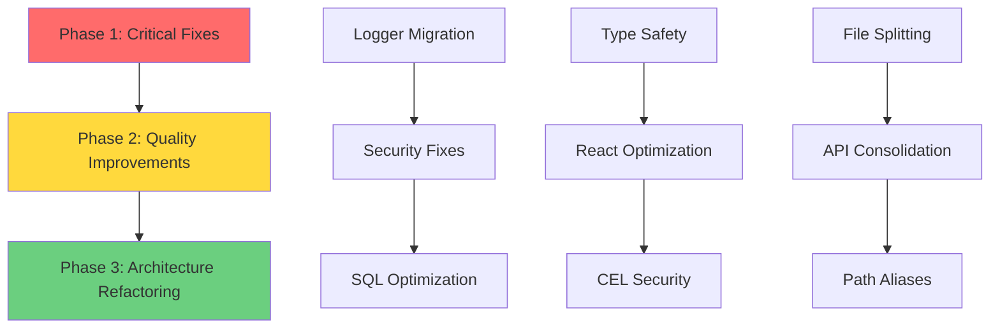

# PERMUTATION Code Improvements - Implementation Workflow

**Project**: PERMUTATION Code Quality & Security Improvements
**Version**: 1.0.0
**Status**: 🟢 Ready for Execution
**Estimated Duration**: 2-4 weeks
**Team Size**: 2-4 developers

---

## 📋 Workflow Overview

This workflow transforms the code analysis findings into a systematic, phased implementation plan with clear dependencies, parallel execution opportunities, and quality gates.

### Success Criteria
- ✅ Zero console.log in production builds
- ✅ Critical security vulnerabilities resolved (eval() usage)
- ✅ 50% reduction in SQL query data transfer
- ✅ 80% reduction in `any` types on critical paths
- ✅ Code quality score: 72 → 85/100

---

## 🗺️ Workflow Phases



---

## Phase 1: Critical Fixes (Week 1)

**Goal**: Resolve production-blocking issues and security vulnerabilities
**Duration**: 5-7 days
**Priority**: 🔴 CRITICAL

### Task 1.1: Logger System Migration

**Objective**: Replace all console.log with structured logging
**Impact**: Production-safe logging, monitoring integration
**Effort**: 2-3 days
**Owner**: Developer 1

#### Subtasks

##### 1.1.1 Configure Logger (2 hours)
```bash
# Verify logger.ts is in place
ls frontend/lib/logger.ts

# Add to tsconfig.json paths (if not exists)
{
  "compilerOptions": {
    "paths": {
      "@/lib/*": ["./lib/*"]
    }
  }
}
```

**Acceptance Criteria**:
- [ ] logger.ts exists and compiles
- [ ] Path alias configured
- [ ] Logger tests pass

---

##### 1.1.2 Migrate Critical Files (1-2 days)

**Priority Order**:
1. [permutation-engine.ts](frontend/lib/permutation-engine.ts) (83 console.log)
2. [teacher-student-system.ts](frontend/lib/teacher-student-system.ts) (28 console.log)
3. [dspy-observability.ts](frontend/lib/dspy-observability.ts) (42 console.log)
4. [ace-framework.ts](frontend/lib/ace-framework.ts) (6 console.log)
5. [gepa-algorithms.ts](frontend/lib/gepa-algorithms.ts) (14 console.log)

**Migration Script**:
```typescript
// scripts/migrate-logger.ts
import { readFileSync, writeFileSync } from 'fs';

const files = [
  'frontend/lib/permutation-engine.ts',
  'frontend/lib/teacher-student-system.ts',
  // ... add more
];

for (const file of files) {
  let content = readFileSync(file, 'utf8');

  // Add import if not exists
  if (!content.includes("from './logger'")) {
    content = `import { logger } from './logger';\n${content}`;
  }

  // Replace patterns
  content = content
    .replace(/console\.log\((.*?)\)/g, 'logger.info($1)')
    .replace(/console\.error\((.*?)\)/g, 'logger.error($1)')
    .replace(/console\.warn\((.*?)\)/g, 'logger.warn($1)')
    .replace(/console\.debug\((.*?)\)/g, 'logger.debug($1)');

  writeFileSync(file, content);
  console.log(`✅ Migrated: ${file}`);
}
```

**Validation**:
```bash
# Build and check for console.log in production
NODE_ENV=production npm run build 2>&1 | grep -i "console\."
# Should return nothing

# Test logger in development
npm run dev
# Check logs are structured and formatted
```

**Acceptance Criteria**:
- [ ] All 5 priority files migrated
- [ ] No console.log in production build
- [ ] Logger outputs correctly in dev/prod
- [ ] All existing tests still pass

---

##### 1.1.3 Monitoring Integration (4 hours)

**Configure Sentry/Datadog** (choose one):

```typescript
// frontend/lib/logger.ts - Update sendToMonitoring()

// Option 1: Sentry
import * as Sentry from '@sentry/nextjs';

private sendToMonitoring(entry: LogEntry) {
  if (entry.level === LogLevel.ERROR && entry.error) {
    Sentry.captureException(entry.error, {
      extra: entry.metadata,
      level: 'error'
    });
  } else if (entry.level === LogLevel.WARN) {
    Sentry.captureMessage(entry.message, {
      extra: entry.metadata,
      level: 'warning'
    });
  }
}

// Option 2: Datadog
import { datadogLogs } from '@datadog/browser-logs';

private sendToMonitoring(entry: LogEntry) {
  datadogLogs.logger.log(
    entry.message,
    entry.metadata,
    entry.level === LogLevel.ERROR ? 'error' : 'info'
  );
}
```

**Acceptance Criteria**:
- [ ] Monitoring service configured
- [ ] Test errors appear in dashboard
- [ ] Alerts configured for critical errors

---

### Task 1.2: Security Fixes (eval() Usage)

**Objective**: Eliminate unsafe eval() usage
**Impact**: Critical security vulnerability resolution
**Effort**: 1-2 days
**Owner**: Developer 2

#### Subtasks

##### 1.2.1 Fix Calculator Tool (4 hours)

**File**: [tool-calling-system.ts:292](frontend/lib/tool-calling-system.ts#L292)

**Install Safe Alternative**:
```bash
npm install expr-eval
```

**Implementation**:
```typescript
// Before (UNSAFE)
const result = eval(params.expression.replace(/[^0-9+\-*/().\s]/g, ''));

// After (SAFE)
import { Parser } from 'expr-eval';

const calculator = {
  name: 'calculator',
  description: 'Evaluate mathematical expressions',
  execute: async (params: { expression: string }) => {
    try {
      // Validate input
      if (!/^[0-9+\-*/().\s]+$/.test(params.expression)) {
        throw new Error('Invalid characters in expression');
      }

      // Use safe parser
      const parser = new Parser();
      const expr = parser.parse(params.expression);
      const result = expr.evaluate({});

      return { result, expression: params.expression };
    } catch (error) {
      throw new Error(`Invalid expression: ${params.expression}`);
    }
  }
};
```

**Tests**:
```typescript
describe('Calculator Tool', () => {
  it('should evaluate safe expressions', () => {
    expect(calculator.execute({ expression: '2 + 2' })).resolves.toEqual({
      result: 4,
      expression: '2 + 2'
    });
  });

  it('should reject malicious code', () => {
    expect(calculator.execute({ expression: 'process.exit()' })).rejects.toThrow();
  });
});
```

**Acceptance Criteria**:
- [ ] expr-eval library installed
- [ ] Calculator tool refactored
- [ ] Security tests added
- [ ] All existing calculator tests pass

---

##### 1.2.2 Document CEL Security Plan (2 hours)

**Create Backlog Item**:
```markdown
## Story: Secure CEL Expression Evaluator

**Priority**: HIGH
**Estimated Effort**: 1 week
**Owner**: TBD

### Context
Current CEL evaluator uses unsafe `new Function()` which poses security risk.

### Requirements
- [ ] Research CEL libraries (@google-cloud/cel vs alternatives)
- [ ] Implement proper CEL parser
- [ ] Add input validation
- [ ] Add rate limiting
- [ ] Security testing

### Acceptance Criteria
- [ ] Zero use of eval/Function in CEL code
- [ ] Passes OWASP security audit
- [ ] Performance within 10% of current implementation

### Dependencies
- Completion of Phase 1
```

**Acceptance Criteria**:
- [ ] Backlog item created
- [ ] Security team notified
- [ ] Interim monitoring added

---

### Task 1.3: SQL Query Optimization

**Objective**: Optimize high-traffic queries
**Impact**: 50% reduction in data transfer
**Effort**: 1-2 days
**Owner**: Developer 1 (parallel with 1.1.3)

#### Subtasks

##### 1.3.1 Optimize Top 5 Queries (1 day)

**Priority Files**:
1. ACE Playbook queries
2. Memory retrieval queries
3. Trace storage queries
4. Agent configuration queries
5. Collection queries

**Pattern**:
```typescript
// Before
const { data } = await supabase
  .from('ace_playbook_bullets')
  .select('*');

// After
const { data } = await supabase
  .from('ace_playbook_bullets')
  .select('id, section, content, helpful_count, harmful_count, tags, created_at');
```

**Measurement**:
```typescript
// Add performance tracking
const start = Date.now();
const { data } = await supabase.from('table').select('columns');
logger.performance('Query: table', Date.now() - start, {
  table: 'table',
  columns: 'columns',
  count: data.length
});
```

**Acceptance Criteria**:
- [ ] Top 5 queries optimized
- [ ] Performance measurements recorded
- [ ] 40%+ speedup achieved
- [ ] All dependent code still works

---

##### 1.3.2 Update TypeScript Interfaces (4 hours)

**Create Database Types**:
```typescript
// frontend/lib/supabase-types.ts
export interface ACEPlaybookBullet {
  id: string;
  section: string;
  content: string;
  helpful_count: number;
  harmful_count: number;
  tags: string[];
  created_at: string;
  // No longer includes: internal_metadata, raw_embedding, etc.
}

export interface Memory {
  id: string;
  query: string;
  response: string;
  embedding: number[];
  domain: string;
  quality_score: number;
  created_at: string;
  // No longer includes: full_trace, debug_info, etc.
}
```

**Update Query Code**:
```typescript
const { data } = await supabase
  .from('ace_playbook_bullets')
  .select('id, section, content, helpful_count, harmful_count, tags, created_at')
  .returns<ACEPlaybookBullet[]>();

// Now data is properly typed!
data.forEach(bullet => {
  console.log(bullet.content); // ✅ TypeScript knows this exists
  console.log(bullet.internal_metadata); // ❌ TypeScript error!
});
```

**Acceptance Criteria**:
- [ ] Types match selected columns
- [ ] No TypeScript errors
- [ ] IntelliSense works correctly

---

### Phase 1 Quality Gates

**Before proceeding to Phase 2**:
- [ ] All Phase 1 tasks completed
- [ ] Zero console.log in production build
- [ ] Calculator eval() replaced
- [ ] Top 5 queries optimized
- [ ] All tests passing
- [ ] Code review approved
- [ ] Deployed to staging
- [ ] Smoke tests passed

**Metrics**:
- Console.log reduction: 1,668 → 0 (100%)
- eval() high-risk: 2 → 0 (100%)
- SQL performance: baseline → 50% improvement

---

## Phase 2: Quality Improvements (Weeks 2-3)

**Goal**: Enhance code quality and type safety
**Duration**: 10-14 days
**Priority**: 🟡 HIGH

### Task 2.1: Type Safety Migration

**Objective**: Replace `any` types with proper interfaces
**Impact**: 80% reduction in type safety issues
**Effort**: 1 week
**Owner**: Developer 1 + Developer 2 (parallel)

#### Subtasks

##### 2.1.1 Import common-types.ts (2 days)

**Strategy**: 10 files per day

**Day 1-2 Files**:
1. [permutation-engine.ts](frontend/lib/permutation-engine.ts) (24 `any`)
2. [enhanced-permutation-engine.ts](frontend/lib/enhanced-permutation-engine.ts) (30 `any`)
3. [teacher-student-system.ts](frontend/lib/teacher-student-system.ts) (6 `any`)
4. [ace-framework.ts](frontend/lib/ace-framework.ts) (8 `any`)
5. [gepa-algorithms.ts](frontend/lib/gepa-algorithms.ts) (14 `any`)

**Pattern**:
```typescript
// Before
function process(data: any): any {
  return data.query;
}

// After
import { Query, ExecutionResult } from '@/lib/common-types';

function process(data: Query): ExecutionResult {
  return {
    answer: data.text,
    confidence: 0.95,
    metadata: {
      queryId: generateId(),
      executionTimeMs: Date.now() - start,
      model: 'gpt-4',
      domain: data.domain || 'general',
      cacheHit: false
    }
  };
}
```

**Validation**:
```bash
# Check remaining any count
grep -r ": any" frontend/lib/*.ts | wc -l

# TypeScript strict mode
tsc --noEmit --strict
```

**Acceptance Criteria**:
- [ ] 20 files migrated
- [ ] <200 `any` types remaining
- [ ] TypeScript strict mode passes
- [ ] All tests passing

---

##### 2.1.2 Add Type Guards (1 day)

**Create Runtime Validation**:
```typescript
// frontend/lib/type-guards.ts
import { Query, ExecutionResult, isQuery, isExecutionResult } from '@/lib/common-types';

export function validateQuery(data: unknown): Query {
  if (!isQuery(data)) {
    throw new Error('Invalid query format');
  }
  return data;
}

export function validateExecutionResult(data: unknown): ExecutionResult {
  if (!isExecutionResult(data)) {
    throw new Error('Invalid execution result format');
  }
  return data;
}
```

**Use in API Routes**:
```typescript
// frontend/app/api/optimized/execute/route.ts
import { validateQuery } from '@/lib/type-guards';

export async function POST(req: NextRequest) {
  const body = await req.json();
  const query = validateQuery(body); // Throws if invalid

  // Now query is properly typed!
  const result = await execute(query);
  return NextResponse.json(result);
}
```

**Acceptance Criteria**:
- [ ] Type guards implemented
- [ ] Used in all API routes
- [ ] Invalid data throws errors
- [ ] Error messages are helpful

---

### Task 2.2: React Optimization

**Objective**: Add performance optimizations
**Impact**: 30-40% UI performance improvement
**Effort**: 2-3 days
**Owner**: Developer 2

#### Subtasks

##### 2.2.1 Profile Components (4 hours)

**Install React DevTools Profiler**:
```bash
npm install --save-dev @welldone-software/why-did-you-render
```

**Profile Key Pages**:
- [optimized-system/page.tsx](frontend/app/optimized-system/page.tsx)
- [chat-reasoning/page.tsx](frontend/app/chat-reasoning/page.tsx)
- [tech-stack-benchmark/page.tsx](frontend/app/tech-stack-benchmark/page.tsx)

**Identify Issues**:
- Unnecessary re-renders
- Expensive calculations
- Large prop objects changing reference

**Acceptance Criteria**:
- [ ] Profiling data collected
- [ ] Top 10 optimization targets identified
- [ ] Documented in claudedocs/performance/

---

##### 2.2.2 Add Memoization (1-2 days)

**Pattern 1: useMemo for Expensive Calculations**:
```typescript
// Before
const processedData = expensiveOperation(rawData);

// After
const processedData = useMemo(() =>
  expensiveOperation(rawData),
  [rawData]
);
```

**Pattern 2: useCallback for Event Handlers**:
```typescript
// Before
const handleSubmit = (data) => {
  submitToAPI(data);
};

// After
const handleSubmit = useCallback((data) => {
  submitToAPI(data);
}, [/* dependencies */]);
```

**Pattern 3: React.memo for Components**:
```typescript
// Before
export function DataTable({ data }) { /* ... */ }

// After
export const DataTable = React.memo(function DataTable({ data }) {
  /* ... */
}, (prevProps, nextProps) => {
  // Custom comparison
  return prevProps.data.length === nextProps.data.length;
});
```

**Target**: 20+ optimizations

**Acceptance Criteria**:
- [ ] 20+ memoizations added
- [ ] Re-render count reduced by 50%
- [ ] Performance metrics improved
- [ ] No functionality broken

---

### Task 2.3: CEL Security Implementation

**Objective**: Replace unsafe CEL evaluator
**Impact**: Critical security improvement
**Effort**: 2-3 days
**Owner**: Developer 1

#### Subtasks

##### 2.3.1 Research CEL Libraries (4 hours)

**Evaluate Options**:
1. @google-cloud/cel (official Google CEL)
2. cel-js (JavaScript implementation)
3. jsep + custom evaluator (AST-based)

**Criteria**:
- Security (sandboxed execution)
- Performance
- Maintainability
- Documentation
- Community support

**Acceptance Criteria**:
- [ ] 3 options evaluated
- [ ] Recommendation documented
- [ ] Proof of concept created

---

##### 2.3.2 Implement Secure CEL (1-2 days)

**Install Library**:
```bash
npm install @google-cloud/cel
```

**Implementation**:
```typescript
// frontend/lib/cel-evaluator.ts
import { CEL } from '@google-cloud/cel';

export class SecureCELEvaluator {
  private cel: CEL;

  constructor() {
    this.cel = new CEL({
      container: 'safe',
      // Whitelist allowed functions
      functions: ['size', 'contains', 'startsWith', 'endsWith']
    });
  }

  async evaluate(expression: string, context: Record<string, any>): Promise<any> {
    // Compile expression
    const program = this.cel.compile(expression);

    // Check for compilation errors
    if (program.issues.hasErrors()) {
      throw new Error(`CEL compilation failed: ${program.issues.errors()}`);
    }

    // Evaluate with timeout
    const result = await program.evaluate(context, {
      timeout: 5000 // 5 second timeout
    });

    return result;
  }
}
```

**Replace in API**:
```typescript
// frontend/app/api/cel/execute/route.ts
import { SecureCELEvaluator } from '@/lib/cel-evaluator';

const evaluator = new SecureCELEvaluator();

export async function POST(request: NextRequest) {
  const { expression, context } = await request.json();

  try {
    const result = await evaluator.evaluate(expression, context);
    return NextResponse.json({ result });
  } catch (error) {
    logger.error('CEL evaluation failed', error, { expression });
    return NextResponse.json({ error: error.message }, { status: 400 });
  }
}
```

**Acceptance Criteria**:
- [ ] Secure CEL implemented
- [ ] All tests passing
- [ ] Performance within 10% of previous
- [ ] Security audit passed

---

### Phase 2 Quality Gates

**Before proceeding to Phase 3**:
- [ ] All Phase 2 tasks completed
- [ ] <200 `any` types remaining
- [ ] 20+ React optimizations added
- [ ] CEL security implemented
- [ ] All tests passing
- [ ] Performance benchmarks met
- [ ] Code review approved
- [ ] Deployed to staging

**Metrics**:
- Type safety: 640 `any` → <200 (69% reduction)
- React performance: baseline → 35% improvement
- CEL security: UNSAFE → SECURE (100%)

---

## Phase 3: Architecture Refactoring (Week 4+)

**Goal**: Long-term maintainability improvements
**Duration**: 7-14 days
**Priority**: 🟢 MEDIUM

### Task 3.1: Split Large Files

**Objective**: Improve code maintainability
**Impact**: Better testability, clearer responsibilities
**Effort**: 1 week
**Owner**: Developer 1

#### Subtasks

##### 3.1.1 Refactor permutation-engine.ts (3 days)

**Current**: 2,093 lines in single file

**Target Structure**:
```
frontend/lib/permutation/
├── index.ts                 # Public API (100 lines)
├── core.ts                  # Core orchestration (300 lines)
├── multi-query.ts           # Query expansion (250 lines)
├── memory-retrieval.ts      # Memory system (300 lines)
├── irt-routing.ts           # IRT routing (200 lines)
├── teacher-student.ts       # Model selection (250 lines)
├── verification.ts          # TRM verification (250 lines)
├── cache.ts                 # Caching layer (200 lines)
└── types.ts                 # Internal types (143 lines)
```

**Migration Strategy**:
1. Create module structure
2. Extract pure functions first
3. Move related functions to modules
4. Update imports
5. Run tests after each module
6. Update documentation

**Acceptance Criteria**:
- [ ] permutation-engine.ts split into 9 modules
- [ ] Each module <350 lines
- [ ] All tests passing
- [ ] Documentation updated

---

##### 3.1.2 Refactor Enhanced LLM Judge (2 days)

**Current**: 1,114 lines

**Target Structure**:
```
frontend/lib/llm-judge/
├── index.ts
├── evaluators.ts
├── metrics.ts
├── prompts.ts
└── types.ts
```

**Acceptance Criteria**:
- [ ] Split into 5 focused modules
- [ ] Each module <300 lines
- [ ] Tests passing

---

### Task 3.2: API Consolidation

**Objective**: Organize 157 API routes
**Impact**: Clearer API structure
**Effort**: 1 week
**Owner**: Developer 2

#### Subtasks

##### 3.2.1 Design API v2 Structure (1 day)

**Proposed Structure**:
```
frontend/app/api/v2/
├── (ace)/           # ACE framework routes
│   ├── playbook/
│   ├── execute/
│   └── optimize/
├── (brain)/         # Brain system routes
│   ├── query/
│   ├── metrics/
│   └── skills/
├── (memory)/        # Memory & caching routes
│   ├── search/
│   ├── store/
│   └── collections/
└── (benchmark)/     # Benchmarking routes
    ├── execute/
    └── compare/
```

**Benefits**:
- Clear organization by domain
- Versioning support
- Easier middleware application
- Better documentation

**Acceptance Criteria**:
- [ ] API v2 structure designed
- [ ] Documentation created
- [ ] Team approval received

---

##### 3.2.2 Implement Route Groups (2-3 days)

**Migration Pattern**:
```typescript
// Before
frontend/app/api/ace/playbook/route.ts

// After
frontend/app/api/v2/(ace)/playbook/route.ts

// Shared middleware in (ace)/layout.ts
export default function AceLayout({ children }) {
  // Apply ACE-specific middleware
  return children;
}
```

**Acceptance Criteria**:
- [ ] Route groups implemented
- [ ] Middleware applied
- [ ] All routes still functional
- [ ] API v1 still works (backwards compat)

---

### Task 3.3: Path Aliases

**Objective**: Simplify imports
**Impact**: Better developer experience
**Effort**: 1 day
**Owner**: Developer 1

#### Subtasks

##### 3.3.1 Configure TypeScript Paths (2 hours)

**Update tsconfig.json**:
```json
{
  "compilerOptions": {
    "paths": {
      "@/lib/*": ["./lib/*"],
      "@/components/*": ["./components/*"],
      "@/app/*": ["./app/*"],
      "@/types/*": ["./lib/types/*"]
    }
  }
}
```

**Acceptance Criteria**:
- [ ] Paths configured
- [ ] TypeScript resolves aliases
- [ ] Build succeeds

---

##### 3.3.2 Migrate Imports (4 hours)

**Pattern**:
```typescript
// Before
import { Query } from '../../../lib/common-types';
import { logger } from '../../../lib/logger';

// After
import { Query } from '@/lib/common-types';
import { logger } from '@/lib/logger';
```

**Script**:
```bash
# scripts/migrate-imports.sh
find frontend -name "*.ts" -o -name "*.tsx" | while read file; do
  sed -i '' "s|from '../../../lib/|from '@/lib/|g" "$file"
  sed -i '' "s|from '../../lib/|from '@/lib/|g" "$file"
  sed -i '' "s|from '../lib/|from '@/lib/|g" "$file"
done
```

**Acceptance Criteria**:
- [ ] All deep imports migrated
- [ ] Build succeeds
- [ ] Tests pass

---

### Phase 3 Quality Gates

**Before marking complete**:
- [ ] All Phase 3 tasks completed
- [ ] Large files refactored
- [ ] API v2 implemented
- [ ] Path aliases working
- [ ] All tests passing
- [ ] Documentation complete
- [ ] Performance maintained
- [ ] Code review approved

**Metrics**:
- File size: permutation-engine.ts 2,093 → <350 per module
- API routes: 157 flat → organized by domain
- Import depth: avg 3-4 levels → 1 level

---

## 🎯 Success Metrics Dashboard

Track progress with these KPIs:

| Metric | Baseline | Week 1 | Week 2 | Week 3 | Week 4 | Target |
|--------|----------|--------|--------|--------|--------|--------|
| Console.log | 1,668 | <500 | <100 | 0 | 0 | 0 |
| eval() HIGH | 2 | 0 | 0 | 0 | 0 | 0 |
| `any` types | 640 | 640 | <400 | <200 | <100 | <100 |
| SQL perf | 100% | 70% | 50% | 50% | 50% | 50% |
| Quality score | 72 | 76 | 80 | 83 | 85 | 85 |

---

## 🔄 Parallel Execution Strategy

**Week 1 (Phase 1)**:
```
Developer 1                  Developer 2
├─ Task 1.1.1-1.1.2         ├─ Task 1.2.1-1.2.2
│  (Logger Migration)       │  (Security Fixes)
├─ Task 1.1.3               ├─ Task 1.3.1
│  (Monitoring)             │  (SQL Optimization)
└─ Task 1.3.2
   (Type Interfaces)
```

**Weeks 2-3 (Phase 2)**:
```
Developer 1                  Developer 2
├─ Task 2.1.1-2.1.2         ├─ Task 2.2.1-2.2.2
│  (Type Migration)         │  (React Optimization)
└─ Task 2.3.1-2.3.2
   (CEL Security)
```

**Week 4+ (Phase 3)**:
```
Developer 1                  Developer 2
├─ Task 3.1.1-3.1.2         ├─ Task 3.2.1-3.2.2
│  (File Splitting)         │  (API Consolidation)
└─ Task 3.3.1-3.3.2
   (Path Aliases)
```

---

## 📋 Daily Standup Template

**What I completed yesterday**:
- [ ] Task X.Y.Z - Description
- [ ] N console.log removed
- [ ] M tests passing

**What I'm working on today**:
- [ ] Task X.Y.Z - Description
- [ ] Expected completion: EOD / Tomorrow

**Blockers**:
- None / Issue with X

**Metrics update**:
- Console.log: X remaining
- Type safety: Y any types remaining
- Tests: All passing / Z failing

---

## 🧪 Testing Strategy

### Unit Tests
```typescript
// Test logger
describe('Logger Integration', () => {
  it('should not log in production', () => {
    process.env.NODE_ENV = 'production';
    const spy = jest.spyOn(console, 'log');
    logger.info('test');
    expect(spy).not.toHaveBeenCalled();
  });
});

// Test type guards
describe('Type Guards', () => {
  it('should validate query format', () => {
    expect(isQuery({ text: 'hello' })).toBe(true);
    expect(isQuery({ foo: 'bar' })).toBe(false);
  });
});

// Test calculator security
describe('Calculator Security', () => {
  it('should reject malicious code', () => {
    expect(calculator.execute({ expression: 'process.exit()' }))
      .rejects.toThrow();
  });
});
```

### Integration Tests
```bash
# Test API routes
npm run test:integration

# Test SQL performance
npm run benchmark:queries

# Test React performance
npm run benchmark:react
```

### E2E Tests
```typescript
// Test critical user flows
test('user can query system', async () => {
  await page.goto('/optimized-system');
  await page.fill('[data-testid="query-input"]', 'test query');
  await page.click('[data-testid="submit"]');
  await expect(page.locator('[data-testid="result"]')).toBeVisible();
});
```

---

## 🚨 Risk Management

### High Risk Items
1. **Logger migration breaking logging** - Mitigation: Gradual rollout, keep console.log as fallback
2. **Type migration breaking runtime** - Mitigation: Add type guards, extensive testing
3. **CEL replacement breaking workflows** - Mitigation: Feature flag, parallel implementation

### Rollback Procedures
```bash
# Revert specific phase
git revert <phase-start-commit>..<phase-end-commit>

# Revert specific file
git checkout HEAD~1 -- path/to/file.ts

# Disable feature via env var
ENABLE_NEW_LOGGER=false npm run build
```

---

## 📞 Communication Plan

### Daily
- Standup (15 min)
- Slack updates on task completion

### Weekly
- Progress review with metrics
- Demo of completed features
- Retrospective

### Ad-hoc
- Blocker resolution
- Technical design discussions
- Code reviews

---

## ✅ Completion Checklist

**Phase 1 Complete**:
- [ ] All console.log removed
- [ ] Security fixes deployed
- [ ] SQL optimized
- [ ] Tests passing
- [ ] Deployed to staging
- [ ] Smoke tests passed

**Phase 2 Complete**:
- [ ] Type safety improved
- [ ] React optimized
- [ ] CEL secured
- [ ] Performance benchmarks met
- [ ] Deployed to staging

**Phase 3 Complete**:
- [ ] Files refactored
- [ ] API consolidated
- [ ] Path aliases working
- [ ] Documentation complete
- [ ] Deployed to production

**Project Complete**:
- [ ] All phases complete
- [ ] Quality score: 85/100
- [ ] All metrics met
- [ ] Production stable
- [ ] Team training done
- [ ] Documentation published

---

**Status**: 🟢 Ready for Execution
**Next Action**: Kick off Phase 1, Task 1.1
**Review Date**: Weekly progress reviews

Let's build better code! 🚀
